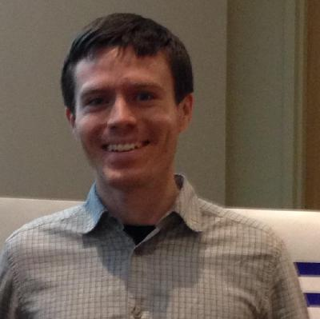

# Curtis Mayberry

Analog, RF, and Software Design Engineer

{ align=left }

Curtis Mayberry is an analog, RF, and software design engineer.

Interests:

- RF IC design
- Analog IC design
- Digital IC design
- open source hardware integrated circuits (OSHIC)

[Cascode-labs](http://www.cascode-labs.org/)

[Skyworks Automated Design](https://skyworksinc.github.io/)
